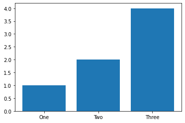

# Fake Lesson

Lorem ipsum dolor sit amet, consectetur adipiscing elit, sed do eiusmod tempor incididunt ut labore et dolore magna aliqua. Ut enim ad minim veniam, quis nostrud exercitation ullamco laboris nisi ut aliquip ex ea commodo consequat. Duis aute irure dolor in reprehenderit in voluptate velit esse cillum CHANGE eu fugiat nulla pariatur. Excepteur sint occaecat cupidatat non proident, sunt in culpa qui officia deserunt mollit anim id est laborum.


```python
# Your code here
```


```python
#==SOLUTION==
answer = 2 + 2
```

Varius sit amet mattis vulputate enim nulla aliquet porttitor lacus. Et magnis dis parturient montes nascetur ridiculus. Vitae purus faucibus ornare suspendisse sed. Vitae purus faucibus ornare suspendisse sed nisi lacus sed viverra. Vitae aliquet nec ullamcorper sit amet risus nullam. Sed tempus urna et pharetra pharetra massa massa. Eget dolor morbi non arcu risus quis varius quam. Metus vulputate eu scelerisque felis imperdiet proin fermentum leo vel. Ut consequat semper viverra nam. Massa enim nec dui nunc. Leo in vitae turpis massa. Viverra justo nec ultrices dui sapien eget mi proin sed. Odio morbi quis commodo odio aenean sed adipiscing diam donec. Blandit aliquam etiam erat velit.


```python
# Your code here
```


```python
#==SOLUTION==
import matplotlib.pyplot as plt
plt.plot([1,2,3], [1,2,3])
```


    [<matplotlib.lines.Line2D at 0x14b44a850>]


    

    


### New Question


```python
# Your code here
```


```python
#__SOLUTION__
print('solution')
```

    solution


### Header 3

Donec pretium vulputate sapien nec sagittis aliquam malesuada. Tristique risus nec feugiat in fermentum. Tincidunt ornare massa eget egestas purus viverra. At varius vel pharetra vel turpis nunc. Pulvinar sapien et ligula ullamcorper malesuada. Vitae tempus quam pellentesque nec nam. Id volutpat lacus laoreet non curabitur gravida arcu. Sem viverra aliquet eget sit amet tellus cras adipiscing. Duis at consectetur lorem donec massa sapien. Fermentum posuere urna nec tincidunt praesent semper. Lacus luctus accumsan tortor posuere ac.


```python
# Replace None with your code

def plot_bar():
    # Create x array
    None
    
    # Create y array
    None
    
    # Plot bar plot
    None
```


```python
#==SOLUTION==
def plot_bar():
    # Create x array
    x = ['One', 'Two', 'Three']
    
    # Create y array
    y = [1,2,4]
    
    # Plot bar plot
    plt.bar(x, y)
```

### Question 4

==SOLUTION==

THIS IS AN ANSWER

Run your code


```python
plot_bar()
```


    

    


```python
#==SOLUTION==
plot_bar()
```


    

    


# Conclusion


```python

```
